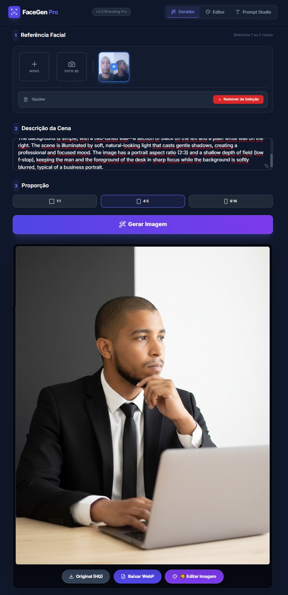
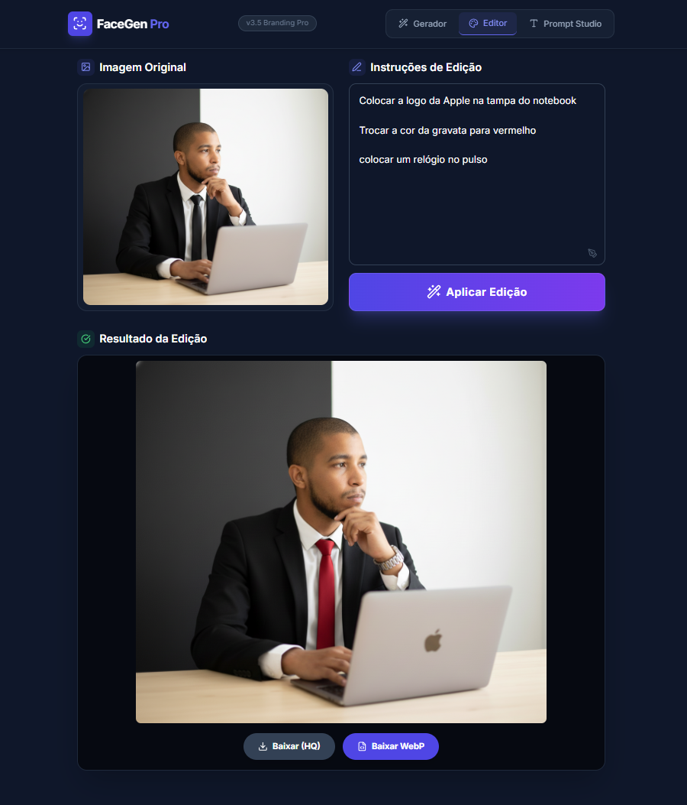
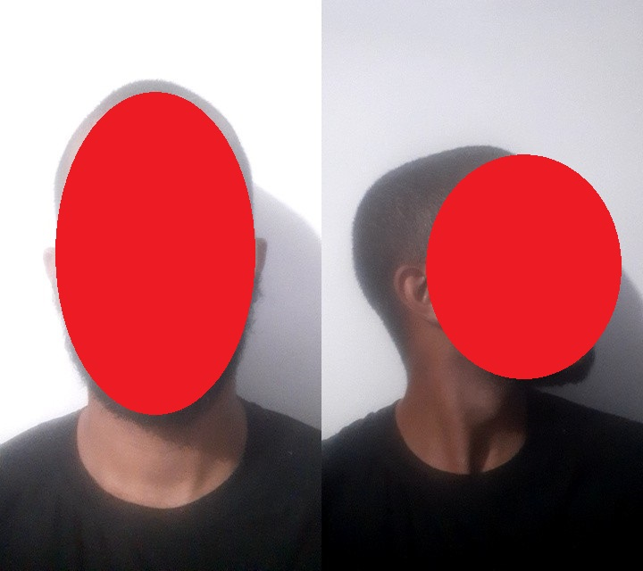
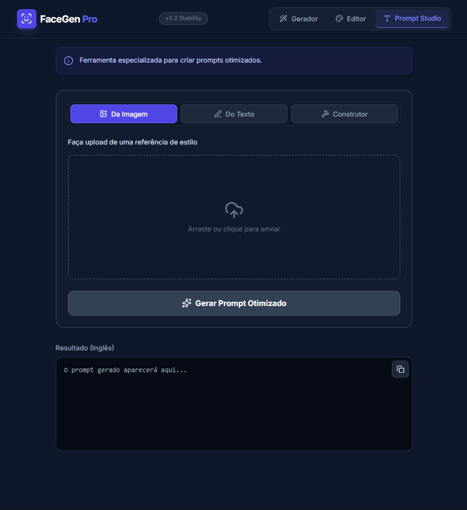
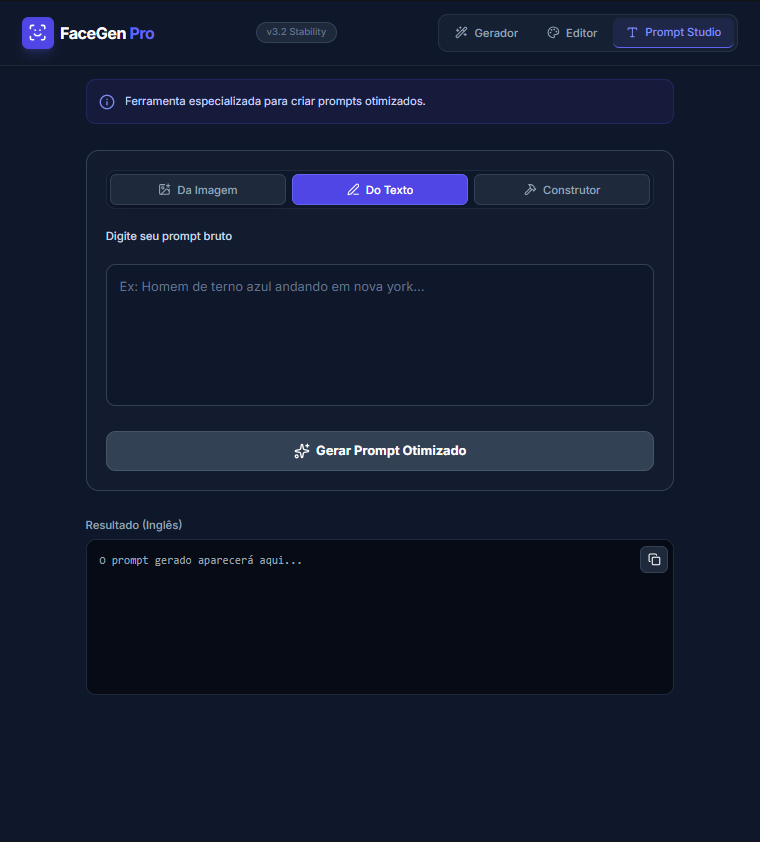
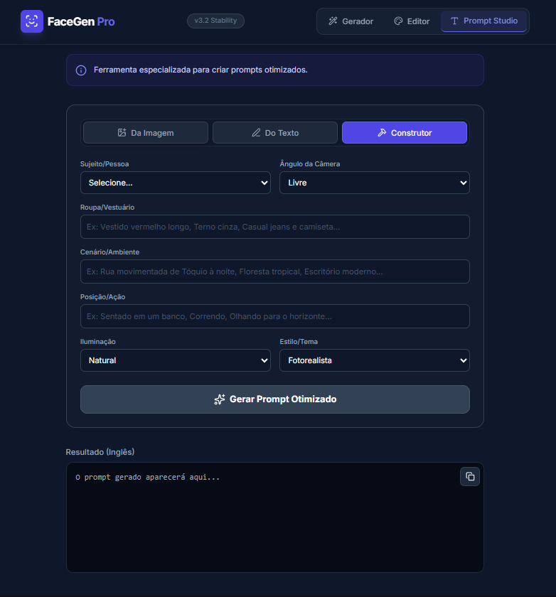

# FaceGen Pro v3.5: Branding & Identity Suite

> **Projeto desenvolvido para o Desafio DIO: "Natural ou Fake Natty?"**

## Descrição

O **FaceGen Pro** não é apenas uma imagem gerada por IA; é uma **aplicação web completa (SPA)** desenvolvida para resolver o maior problema da IA Generativa atual: **Consistência de Identidade e Controle de Marca.**

Diferente de gerar uma imagem aleatória, esta ferramenta utiliza a API do **Google Gemini 2.5** aliada a técnicas avançadas de *Prompt Engineering* e *Computer Vision* para clonar rostos com precisão "Natty" (Natural) ou criar logos artísticos integrados.

## Tecnologias Utilizadas
* **Ferramenta:** Canvas do Google Gemini (espaço de trabalho interativo e dinâmico que permite criar, editar e visualizar conteúdo em tempo real, com assistência de IA);
* **Frontend:** HTML5, TailwindCSS (via CDN), Vanilla JS (ES6 Modules).
* **AI Core:** Google Gemini API (`gemini-2.5-flash-image-preview`).
* **Backend/Database:** Firebase Firestore (para armazenar a biblioteca de prompts e referências faciais).
* **Auth:** Firebase Authentication (Anônima e Custom Tokens).
* **Hardware Integration:** API `MediaDevices` do navegador para captura e processamento de textura facial em tempo real.

### Screenshots do Ecossistema

| Gerador de Identidade | Editor Integrado  | Captura 3D |
|:---------------------:|:---------------------:|:----------:|
|  |  |  |

> [!WARNING]
> Por questões de segurança, cobri o rosto da imagem gerada com a câmera da aplicação.

#### Outros Prints

  

## Engenharia por Trás do "Fake Natty"

O realismo extremo ("Natty") é alcançado através de um pipeline técnico complexo implementado em JavaScript puro:

### 1. Captura e Fusão 3D (Photogrammetry-lite)
O sistema possui um módulo de câmara que captura o rosto do utilizador em dois ângulos (frontal e perfil).
* **Processamento:** O algoritmo recorta as imagens em proporção 9:16 e cria uma fusão ("stitch") das duas perspetivas numa única textura.
* **Resultado:** Fornece ao modelo Gemini uma compreensão volumétrica do rosto, superior a uma simples foto 2D.

### 2. "System Instructions" Dinâmicas
O código injeta instruções de sistema diferentes baseadas no tipo de geração:
* **Modo Humano:** Ativa o protocolo `MULTI-FACE IDENTITY TRANSFER`, forçando o modelo a ignorar a pose da referência e usar apenas a biometria facial.
* **Modo Branding (Logo):** Ativa a lógica `ADVANCED LOGO ARTISTRY`, onde o logo não é colado, mas "cresce" organicamente a partir dos elementos da imagem (ex: néon, montanhas, arquitetura).

## Prompt Studio: O Ecossistema de Criação

Para garantir a qualidade "Fake Natty", desenvolvi um módulo dedicado à **Engenharia de Prompt Assistida**, composto por agentes especializados:

### 1. Vision Analyst (Engenharia Reversa de Imagens)
Ao contrário de ferramentas comuns que apenas descrevem uma imagem, criei um agente que **extrai o estilo ignorando a identidade**.
* **A Lógica:** O sistema utiliza uma instrução de sistema rígida (*"STRICTEST RULE: ABSOLUTELY NO FACIAL DESCRIPTIONS"*) para analisar pixel a pixel a iluminação, ângulo da câmara, tecido das roupas e cenário, mas bloqueia qualquer menção a olhos, cabelo ou idade.
* **O Objetivo:** Permitir copiar o *estilo* de uma foto famosa sem que o rosto original interfira na clonagem da própria face.

### 2. Prompt Sanitizer (Corretor Inteligente)
Um agente de texto que atua como "firewall" criativo.
* **Função:** Recebe a ideia bruta do utilizador e reescreve-a, removendo automaticamente descrições físicas que geram conflito (como "olhos azuis" ou "cabelo louro"), garantindo que o modelo de geração use apenas a identidade injetada pelas fotos de referência.

### 3. Builder Paramétrico
Uma interface "No-Code" para construção de prompts complexos.
* **Controle Total:** Permite selecionar variáveis técnicas como *Camera Angle* (ex: Dutch Angle, Low Angle), *Lighting* (ex: Volumetric God Rays, Cyberpunk Neon) e *Film Stock*, sintetizando tudo num prompt estruturado profissionalmente.

### 4. Editor Integrado (Inpainting/Refinement)
Módulo de pós-processamento que permite alterar elementos específicos da imagem gerada (ex: "trocar o fato por um casaco de cabedal") mantendo a consistência facial e a identidade original intactas.

## Resultados

**O Veredito:** Natural ou Fake Natty?

**Fake Natty de Elite.**

Ele gera imagens que são 100% sintéticas, mas a aplicação de **texturas de pele**, **iluminação baseada em física (PBR)** e a **preservação de identidade** tornam o resultado similar a uma fotografia para a maioria dos observadores, onde a distinção entre o real e o artificial é quase imperceptível.

A ferramenta prova que o "Fake Natty" perfeito não vem apenas do modelo de IA, mas da **ferramenta que construímos ao redor dele** para controlar as alucinações.

## Reflexão
Criar este projeto revelou que o verdadeiro segredo do "Fake Natty" não está apenas na potência do modelo de IA, mas na **restrição do contexto**.

O maior desafio não foi fazer a IA criar uma imagem bonita, mas sim **impedi-la de ser criativa demais** com o rosto do usuário. A conclusão é que, para obter resultados hiper-realistas e consistentes, precisamos construir ferramentas que atuem como "trilhos", guiando a alucinação da máquina para que ela respeite a geometria da realidade. O futuro não é apenas "promptar", é arquitetar sistemas que controlem a geração.

---
⌨️ Desenvolvido por Amaro Netto

